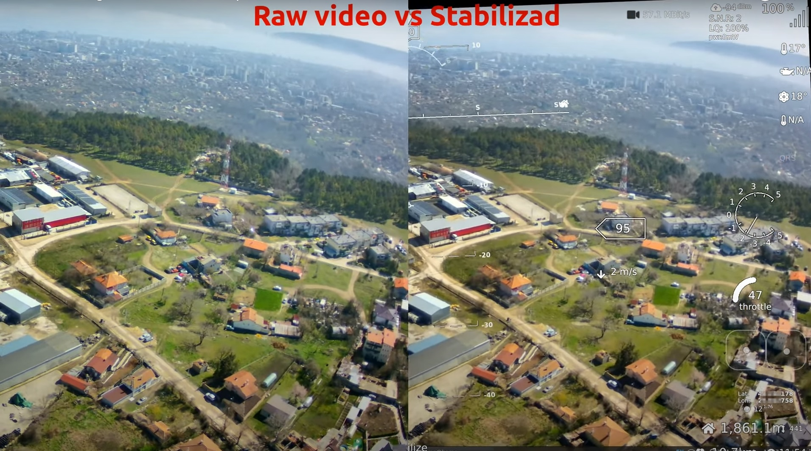

# ejo_wfb_stabilizer.py


<a href="https://www.youtube.com/watch?v=QLSFAsYO4MM">
    
</a>  

  
A simple rough proof-of-concept starter script to stabilize video stream with low latency from wifibroadcast FPV (or any streaming source). Works out of the box sufficiently well with 720p and lower digital FPV video streams. This is not meant to be a cinema quality stabilizer: It is tool to make a jittery/bumpy FPV feed tolerable while adding the least possible amount of latency to the stream.

About: I put this together because I could not find any simple open-source ultra low latency software stabilization for FPV. Most video stabilization solutions are designed for post-processing video files, and the fastest live-streaming stabilizers that I could find added hundreds of milliseconds latency at best which is not suitable for FPV. I observed that the common solution to reduce processing time is to downsample the frames, run the point-feature matching (or other processing) on the low-res frames, then scale up the translation to the full frame size by multiplying the resulting matrix against a scale matrix. Unless I was doing it wrong (a definite possibility), using the downsample method unsurprisingly affects the stabilizer's accuracy, resulting in a noticeable annoying jitter when operating an off-road vehicle at high speeds. The simple method employed here differs in that it crops out a region of interest (ROI) then moves each point found within the ROI to the full-sized frame's coordinate before further processing and smoothing. It does not downsample the entire frame and therefore retains the same  stabilization accuracy as a full sized frameset, resulting in a smooth low-latency stabilized video stream. I am certain I am not to first to do this but I could not find any open-source examples as everyone appears to employ the downsample method, if any.

Intended audience: Folks using wifibroadcast FPV variants with a x86 groundstation. Doubtful this will work at all on Raspberry Pi groundstations (haven't bothered to try).

Requires: Python, OpenCV-python, gstreamer and probably other libraries I forgot about

    Linux (roughly) - apt install python3 python3-opencv gstreamer1.0-plugins-*

    Windows - Install python from the windows app store then open a command prompt and run 'pip install opencv-python'


The default SRC listens for an RTP H.265 stream (payload 97) on UDP port 5600. Edit the file and set the SRC variable to match your own streaming source.

## Testing with a recorded video

`replay_stream.py` sends a recorded HEVC .mov/.mp4 to UDP port 5600 as an RTP H.265 stream (payload 97), the same as a live wfb-ng feed, so the stabilizer can be tested without a drone. The video is not re-encoded and is played at its recorded frame rate.

1. In one terminal, start the replay (loops seamlessly until Ctrl+C):

   ```
   python3 replay_stream.py ~/Video/vid2209_1735_40_shaking.mov
   ```

   Options: `--once` to play once, `--host` / `--port` to send to another machine or port.

2. In another terminal, start the stabilizer the way you normally run it, e.g.:

   ```
   python3 ejo_wfb_stabilizer.py msposd
   ```

3. Press S or Space to turn stabilization on (it starts off). The FPS shown on the video and the per-step timing table printed to the console every second show whether the stabilizer keeps up; "Skipped frame" lines are frames it dropped.

Notes:
- Replay one recording per run. Switching between recordings made with different encoder settings in the same stream can make vaapih265dec abort.
- The included UnstabilizedTest10sec.mp4 is H.264, so it does not match the default H.265 SRC.


<hr>

Notes:

Higher FPS = lower latency, better cleaner stabilization.

On a moderate PC, this should stabilize 720p @ 49fps (v1 camera max 720p fps) pretty well, however, for ultra fast movements it is better to run 60-90fps which requires a genuine V2 cam or V1 cam in VGA mode. I often run the V1 camera VGA mode @ 90fps at 960x540 which stabilizes really well and feels like a brushless gimbal,  the trade-off being lower resolution. Should be good for RC FPV car racing.
    
My groundstation PC has a nvidia gpu and opencv compiled with cuda support and can handle the stabilization demands at 720p. A lower-end PC may require running a lower resolution stream, lower fps, or adjusting the script to use a smaller ROI.

## TipoMan EDIT 2024 
Added a separate thread for video processing, increased performance by 25%.
OSD overlay (qOpenHD or msposd) will be started and brought to foreground, so that OSD is drawn.
Select it with the first argument: no argument = video only, no OSD; `msposd`; `qopenhd`; `noosd` = wfb-ng link stats window only.
Overloading and video jitter  won't cause total image loss or latency , instead FPS will gradually decrease to the value the system can process.

## Hotkeys
Space or S - Switch on/off stabilized mode
ESC or Q - exit and close qOpenHD

On a i3-1215u can stabilize 1920x1080 at 50fps (40fps on Battery power), while recording h264 30fps video from the screen.
SPACE - Turn on/off stabilization
TAB - toggle stab mode Fast/Slow
ESC - Quit

WARNING, you may need to build OpenCV with GSTREAMER support : https://docs.opencv.org/3.4/d2/de6/tutorial_py_setup_in_ubuntu.html

## render_direct.py
A simple python wrapper for gstreamer fullscreen video decoding  
```python3 NoOSD``` 

## gs.c
Same in C  

## osd_overlay
Shows wfb_ng statistics using mavlink  


